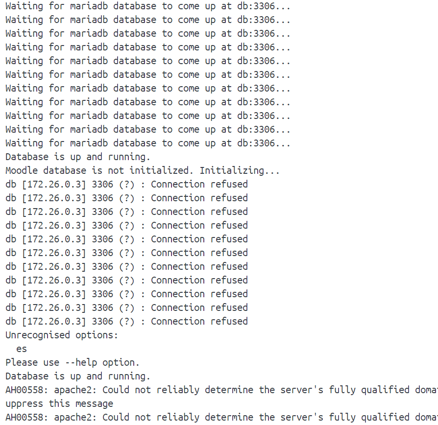

## Known Issues

* When using NFS shared volume for `/moodledata`, you may get `session data file is not created by your uid` error. It is due to the NFS mount user id mapping is not consistent with local user id. Use Redis session for workaround.
* By default application cache is using file store, which is pretty slow. Configure Redis to be used for application cache: `Site administration`->`plugins`->`caching`->`Configuration`->under `Redis` row, click add instance

# Error en la inicialización de la BBDD

Si sale el siguiente error, sencillamente arrancar de nuevo el contendor de la aplicación web y debería instalarse bien.
